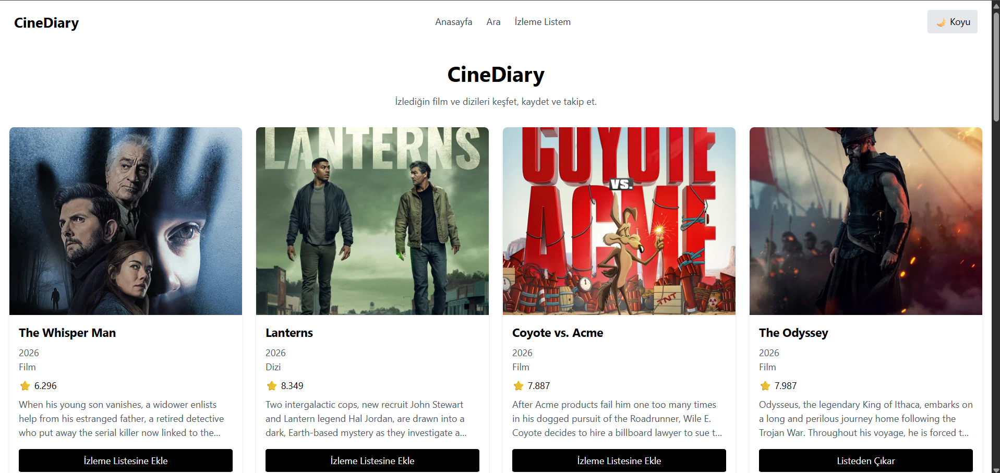

# CineDiary

CineDiary, film ve dizi aramak, bunların izleme listesine kaydetmek için yaptığım bir web projesidir.

TMDB API kullanarak film ve dizi bilgilerini gösterir. Kullanıcılar film ve dizileri arayabilir, detaylarını görebilir ve izleme listesine ekleyebilir.

## Özellikler

- Film ve dizi arama
- Film ve dizi detaylarını görüntüleme
- İzleme listesi oluşturma
- İzleme listesini localStorage ile kaydetme
- Dark / Light mode
- Hata mesajı ve tekrar deneme
- Loading spinner

## Kullanılan Teknolojiler

- React
- TypeScript
- Vite
- React Router
- Tailwind CSS
- TMDB API

## Nasıl Çalıştırılır?

Projeyi indirdikten sonra terminalde:

npm install

Daha sonra:

npm run dev

komutlarını çalıştırın.

Kendi TMDB API anahtarınızı `.env` dosyasına aşağıdaki formatta ekleyin:

VITE_TMDB_API_KEY=API_KEYINIZ

## Canlı Proje

Netlify üzerinde yayınlanmıştır.

## Ekran Görüntüsü

